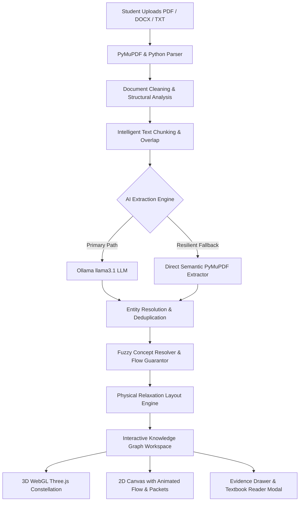

# Visual Concept Mapper — AI-Powered STEM Knowledge Graph

> **Turn dense textbook chapters and academic papers into interactive 3D & 2D knowledge graphs with verifiable citations.**

[](https://nextjs.org/)
[](https://react.dev/)
[](https://www.typescriptlang.org/)
[](https://threejs.org/)
[](https://pymupdf.readthedocs.io/)
[](https://ollama.com/)
[](https://tailwindcss.com/)

---

## 📖 Table of Contents

- [Overview](#-overview)
- [System Architecture](#-system-architecture)
- [Key Features](#-key-features)
  - [1. Real PDF & Document Processing Pipeline](#1-real-pdf--document-processing-pipeline)
  - [2. Interactive 3D & 2D Graph Visualizer](#2-interactive-3d--2d-graph-visualizer)
  - [3. Verifiable Evidence & In-App Reader](#3-verifiable-evidence--in-app-reader)
  - [4. Dynamic 7-Day Free Trial & Usage Tracking](#4-dynamic-7-day-free-trial--usage-tracking)
  - [5. Authentication & Quick Profiles](#5-authentication--quick-profiles)
- [Directory Structure](#-directory-structure)
- [Technology Stack](#-technology-stack)
- [Getting Started](#-getting-started)
  - [Prerequisites](#prerequisites)
  - [Installation](#installation)
  - [Local AI Setup (Optional)](#local-ai-setup-optional)
  - [Running the Application](#running-the-application)
- [Application Routes](#-application-routes)
- [Layout & Anti-Collision Engine](#-layout--anti-collision-engine)
- [Verification & Testing](#-verification--testing)
- [License](#-license)

---

## 🔬 Overview

Undergraduate and graduate STEM students frequently face dense, mathematically rigorous textbooks where critical connections between theorems, definitions, operators, and models are obscured across hundreds of pages.

**Visual Concept Mapper** bridges this gap:
1. A student uploads an authentic textbook chapter or academic paper (`PDF`, `DOCX`, or `TXT`).
2. The system executes a high-speed Python/PyMuPDF extraction engine with intelligent chunking and section boundary detection.
3. Local or cloud LLMs (via Ollama or structured semantic extraction) extract genuine STEM concepts and directed mathematical relationships.
4. An anti-collision physical relaxation layout engine places concepts into a collision-free 2D and 3D constellation.
5. Students can explore relationships with **animated energy flow packets**, inspect exact textbook quote evidence, and search across concepts with `⌘K`.

---

## 🏛 System Architecture



---

## ✨ Key Features

### 1. Real PDF & Document Processing Pipeline
- **Zero Dummy Data**: Does not return hardcoded matrices or neural networks unless they actually appear in the uploaded document.
- **PyMuPDF (`fitz`) Text Extraction**: Cleans running headers, footers, page numbers, and isolates authentic chapter/section headings.
- **Streaming SSE Progress**: Real-time Server-Sent Events (`/api/analyze/stream`) broadcast extraction progress:
  - `reading` (PyMuPDF document extraction)
  - `extracting_concepts` (AI passage analysis)
  - `discovering_relations` (entity resolution and edge linking)
  - `building_graph` (3D/2D spatial coordinate generation)
- **High-Resilience Extraction**: If local LLM CPU inference is delayed, the pipeline automatically falls back to direct semantic sentence parsing, guaranteeing zero unhandled timeouts or crashes.

### 2. Interactive 3D & 2D Graph Visualizer
- **3D Constellation Mode (Three.js)**:
  - Category-colored glowing spheres with emissive intensity.
  - Floating 3D billboard text sprites displaying concept names clearly above each node.
  - Dual staggered animated energy packets streaming continuously along every edge.
  - Smooth camera focus lerping, orbital rotation, zoom, pan, and reset.
- **2D Canvas Mode**:
  - High-DPI interactive pan and zoom with draggable node cards.
  - Smooth cubic bezier curves with SVG directional marker arrows.
  - **Animated Connection Flow**: Continuously moving dashed strokes (`stroke-dashoffset`) accompanied by dual traveling glowing energy particles.
  - Midpoint relationship badges with direction arrows (`→`) and evidence previews.

### 3. Verifiable Evidence & In-App Reader
- **Exact Textbook Evidence**: Click any concept or relationship to inspect the verbatim textbook quote, highlighted phrase, page number, and source section.
- **Chapter Reader Modal**: Read the full context of any section with sentence-level highlighting verifying why the relationship exists.
- **Search & Filters (`⌘K`)**:
  - Global command search across all concept names, definitions, and sections.
  - Filter by category (`Core Math`, `Transforms`, `Optimization`, `Deep Learning`, `ML Bridge`).
  - Filter by connectivity (hub nodes vs prerequisites).

### 4. Dynamic 7-Day Free Trial & Usage Tracking
- **Day 1 Activation**: Every new account automatically begins a **7-Day Free Trial** with a **5,000 AI credit allowance**.
- **Dynamic Countdown**: Time remaining is calculated dynamically from the stored start date (`ACTIVE`, `EXPIRING_SOON` < 48h, `EXPIRED`).
- **Graceful Expiration**: If a trial ends, existing concept maps remain fully viewable in the workspace, while new PDF extractions prompt for a subscription upgrade.
- **Usage Dashboard (`/usage`)**: Displays credit consumption breakdown, activity history log, and developer fast-forward simulation controls.

### 5. Authentication & Quick Profiles
- Dedicated `/login` page supporting both new trial registration and existing sign-in.
- **1-Click Quick Demo Profiles**:
  - `Jordan Taylor` (Undergraduate Student)
  - `Dr. Elena Rostova` (STEM Researcher)
- Allows instant evaluation and navigation without credential friction.

---

## 📁 Directory Structure

```text
├── public/
│   └── samples/                   # Preloaded sample STEM textbook chapters (PDFs)
│       ├── Linear_Algebra_Spectral_Theory_Ch5.pdf
│       ├── Machine_Learning_Optimization_Ch8.pdf
│       └── Quantum_Mechanics_Wavefunctions_Ch3.pdf
├── scripts/
│   ├── generate_sample_stem_pdfs.py  # Script generating sample STEM PDF fixtures
│   ├── test_ollama.py                # Local Ollama connection test
│   ├── test_relationships.py         # Relationship extraction verification
│   └── test_unified_pipeline.py      # End-to-end Python pipeline test
├── src/
│   ├── app/
│   │   ├── api/
│   │   │   ├── analyze/
│   │   │   │   ├── route.ts          # Synchronous POST analysis endpoint
│   │   │   │   └── stream/route.ts   # Server-Sent Events (SSE) streaming endpoint
│   │   ├── demo/
│   │   │   └── page.tsx              # Isolated flagship demo showcase (0 credits consumed)
│   │   ├── login/
│   │   │   └── page.tsx              # Account login, registration & 1-click profiles
│   │   ├── subscription/
│   │   │   └── page.tsx              # Tier comparison & upgrade pricing (UI prototype)
│   │   ├── usage/
│   │   │   └── page.tsx              # Credit balance, trial analytics & dev simulator
│   │   ├── globals.css               # Futuristic STEM theme, glowing effects, grid backgrounds
│   │   ├── layout.tsx                # App root layout with font and metadata configuration
│   │   └── page.tsx                  # Main client controller (Upload -> Process -> Workspace)
│   ├── components/
│   │   ├── concept-panel/            # Right-side concept details & relationship evidence modals
│   │   ├── dashboard/                # "My Concept Maps" directory with real & sample maps
│   │   ├── filters/                  # Multidimensional concept & relationship filter panels
│   │   ├── graph/                    # 3D WebGL (Three.js), 2D Canvas, and controls
│   │   │   ├── Graph2D.tsx           # 2D graph with animated energy packets and anti-collision
│   │   │   ├── Graph3D.tsx           # 3D graph with billboard text sprites and flowing packets
│   │   │   ├── GraphControls.tsx     # Zoom, 2D/3D toggle, reset view, and section toggles
│   │   │   └── WorkspaceView.tsx     # Full-screen workspace orchestrator
│   │   ├── landing/                  # Futuristic landing hero with interactive background 3D map
│   │   ├── processing/               # Animated processing screen with live stage updates
│   │   ├── reader/                   # In-app textbook reader with highlighted evidence
│   │   ├── search/                   # ⌘K Command search modal
│   │   ├── trial/                    # Top trial countdown banner & limit enforcement modal
│   │   └── upload/                   # Drag-and-drop PDF/DOCX/TXT modal with credit estimation
│   ├── data/
│   │   └── demoGraph.ts              # Flagship Linear Algebra -> Neural Networks showcase
│   ├── lib/
│   │   ├── ai/
│   │   │   └── pipeline.ts           # Client-side SSE stream listener
│   │   ├── server/
│   │   │   ├── aiExtractor.py        # Standalone Python extraction engine
│   │   │   ├── aiPipelineService.ts  # Real server pipeline coordinator
│   │   │   ├── aiProvider.ts         # Ollama / OpenAI abstraction & entity resolution
│   │   │   ├── graphBuilder.ts       # Anti-collision force-directed layout generator
│   │   │   └── pdfParser.py          # PyMuPDF & python-docx parser script
│   │   └── services/
│   │       └── trialService.ts       # Dynamic 7-day trial & credit accounting service
│   └── types/
│       └── graph.ts                  # TypeScript definitions for Concepts, Edges, Chapters
├── package.json
├── tsconfig.json
└── README.md
```

---

## 🛠 Technology Stack

| Domain | Technology | Version | Purpose |
| :--- | :--- | :--- | :--- |
| **Framework** | Next.js (App Router) | 16.3.7 | Fullstack React framework with Turbopack |
| **UI Library** | React | 19.2.8 | Declarative component framework |
| **Language** | TypeScript | 5.x | Strict end-to-end type safety |
| **Styling** | Tailwind CSS | v4 | Modern styling with HSL STEM dark palettes |
| **3D Rendering** | Three.js | 0.183 | WebGL 3D knowledge graph, halos & particle flows |
| **Document Parser** | PyMuPDF (`fitz`) | 1.28.2 | Fast Python textbook text & section extraction |
| **Document Parser** | python-docx | 1.2.0 | Microsoft Word (.docx) document parsing |
| **Local LLM** | Ollama (`llama3.1`) | Latest | Local concept & relationship inference |
| **Icons** | Lucide React | 1.16.0 | Sleek mathematical and UI iconography |

---

## 🚀 Getting Started

### Prerequisites

1. **Node.js**: `v18.0.0` or higher (tested on Node `v24.x`).
2. **Python**: `3.10` or higher with `pip`.
3. *(Optional)* **Ollama**: For local offline LLM extraction.

### Installation

1. **Clone the repository**:
   ```bash
   git clone https://github.com/your-org/visual-concept-mapper.git
   cd visual-concept-mapper
   ```

2. **Install Node.js dependencies**:
   ```bash
   npm install
   ```

3. **Install Python dependencies**:
   ```bash
   pip install pymupdf python-docx pdfplumber
   ```

### Local AI Setup (Optional)

If you wish to use local Ollama inference:
1. Download and start [Ollama](https://ollama.com/).
2. Pull the default model:
   ```bash
   ollama pull llama3.1:latest
   ```
3. Keep Ollama running on `http://127.0.0.1:11434`.
> *Note: If Ollama is not running, the application will automatically engage its high-speed direct PyMuPDF semantic extractor without failing.*

### Running the Application

1. **Start the development server**:
   ```bash
   npm run dev
   ```

2. Open **[http://localhost:3000](http://localhost:3000)** in your browser.

---

## 🗺 Application Routes

| Route | Purpose | Access |
| :--- | :--- | :--- |
| `/` | **Hero Landing & Main Workspace** | Default entry point with upload, processing, and interactive graph |
| `/demo` | **Flagship Interactive Showcase** | Linear Algebra → Neural Networks demo (0 trial credits consumed) |
| `/login` | **Authentication & Profiles** | Start 7-day trial, sign in, or click 1-click student/researcher demo accounts |
| `/usage` | **Usage & Trial Analytics** | Trial countdown, credits used, history log, and developer time-travel simulator |
| `/subscription` | **Subscription Plans** | Student ($9/mo) and Pro ($24/mo) plan details and upgrade previews |
| `/api/analyze/stream` | **SSE Extraction Pipeline** | Real-time streaming API endpoint for uploaded documents |

---

## 📐 Layout & Anti-Collision Engine

One of the common issues in automated graph visualizers is **node overlap** (where nodes with identical or near-identical coordinates collapse into unreadable clusters).

Visual Concept Mapper implements a **two-tier anti-collision system**:

1. **Server-Side Fruchterman-Reingold Relaxation ([graphBuilder.ts](file:///c:/Users/Sumana/OneDrive/Desktop/docpulse_ai/new_model/src/lib/server/graphBuilder.ts))**:
   - Nodes are distributed evenly around $360^\circ$ with radii staggered by concept importance ($R \in [260, 480]\text{px}$).
   - A physical simulation runs **60 iterations** where nodes repel each other with a hard minimum separation of **260px**.
   - Connected concepts gently attract each other, creating natural disciplinary lobes.
2. **Client-Side Anti-Overlap Enforcement ([Graph2D.tsx](file:///c:/Users/Sumana/OneDrive/Desktop/docpulse_ai/new_model/src/components/graph/Graph2D.tsx) & [Graph3D.tsx](file:///c:/Users/Sumana/OneDrive/Desktop/docpulse_ai/new_model/src/components/graph/Graph3D.tsx))**:
   - In 2D: Enforces a minimum center-to-center distance of **$\ge 240\text{px}$** between all HTML cards.
   - In 3D: Enforces a minimum center-to-center distance of **$\ge 1.45\text{ units}$** between all spheres.

---

## 🧪 Verification & Testing

To verify TypeScript correctness and build output:

```bash
# Type check with TypeScript compiler
npx tsc --noEmit

# Compile production build
npm run build
```

---

## 📜 License

This project is developed as a STEM educational application prototype. Released under the **MIT License**.
